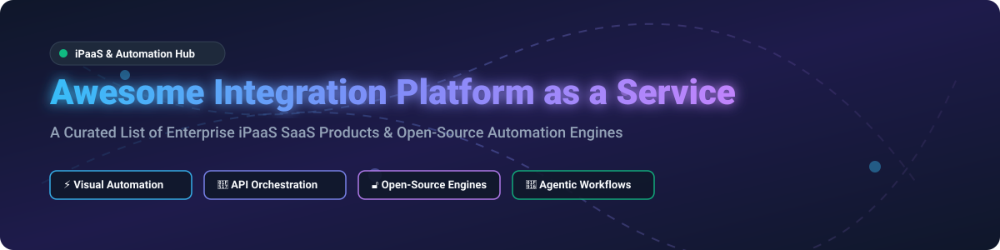

# ⚡ Awesome Integration Platform as a Service (iPaaS) 

  
  
  
  
  

## 🚀 Overview & Market Landscape

A curated list of top **Integration Platform as a Service (iPaaS)** solutions, enterprise workflow automation engines, API orchestration tools, data synchronization frameworks, and open-source self-hosted automation platforms.

### 📊 Market Size & Industry Structure
> 💡 **Market Size:** The global Integration Platform as a Service (iPaaS) market is estimated at **$10B–$15B in 2025–2026** and is projected to exceed **$35B+ by 2030** (growing at a ~25-30% CAGR).  
> 🧩 **Market Concentration:** The market is **moderately fragmented**. While enterprise giants (MuleSoft, Boomi, Azure Logic Apps) hold major corporate market share, agile PLG platforms (Zapier, Make) and open-source engines (n8n, Temporal, Activepieces) capture extensive developer and mid-market adoption.

---

## 📑 Table of Contents
- [☁️ SaaS / Hosted iPaaS Platforms](#-saas--hosted-ipaas-platforms)
- [🔓 Open-Source GitHub Projects](#-open-source-github-projects)
- [🤝 How to Contribute](#-how-to-contribute)
- [💖 Support & Community](#-support--community)
- [📈 Star History](#-star-history)
- [⚠️ Disclaimer](#%EF%B8%8F-disclaimer)

---

## ☁️ SaaS / Hosted iPaaS Platforms

Commercial Integration Platforms as a Service (iPaaS) ordered by estimated enterprise size and valuation (descending).

| Platform | Description | Enterprise Scale (Revenue / Valuation) | Starting Pricing | Free Tier / Trial Limit |
| :--- | :--- | :--- | :--- | :--- |
| **[MuleSoft Anypoint Platform](https://www.mulesoft.com/platform/saas/anypoint-platform)** 🏢 | Enterprise integration platform focused on API-led connectivity, governance, and complex hybrid integrations (Salesforce). | **~$450M+ ARR** ($6.5B acquisition valuation) | Starts at **$27,000/year** (Gold Tier) | 30-day free trial (Anypoint Platform trial account) |
| **[Boomi](https://boomi.com/)** 🌐 | Cloud-native iPaaS with strong support for hybrid environments, API management, master data, and enterprise connectivity. | **~$516M ARR** (Private PE backed) | Starts at **$549/month** | 30-day free trial (Full platform access) |
| **[Zapier](https://zapier.com/)** ⚡ | Leading no-code automation platform with 7,000+ app connectors, popular for business workflows and multi-step integrations. | **~$310M ARR** ($5.0B valuation) | Starter plan from **$19.99/month** (billed annually) | **Free Forever Plan**: 100 tasks/month, 5 single-step Zaps |
| **[Workato](https://www.workato.com/)** 🤖 | Enterprise automation and iPaaS platform combining low-code recipes with AI-assisted orchestration for IT and enterprise operations. | **~$150M ARR** ($5.7B valuation) | Starts at **$10,000/year** (Base workspace + recipe packs) | 30-day enterprise free trial |
| **[Jitterbit](https://www.jitterbit.com/)** 🔗 | iPaaS and API management platform for connecting applications, data, and processes across cloud and on-premises systems. | **~$105M ARR** (Private equity backed) | Starts at **$1,000/month** (Standard edition) | 30-day free trial |
| **[Celigo](https://www.celigo.com/)** 📊 | Integration platform specialized in SaaS-to-SaaS and operational integrations with pre-built connectors and business templates. | **~$92M ARR** (Private VC backed) | Standard tier starts at **$600/month** | **Free Edition**: 1 active flow, 500 records/month |
| **[Tray.io](https://tray.io/)** 🛠️ | Low-code automation and integration platform aimed at connecting SaaS applications and building complex business workflows. | **~$71M ARR** ($600M valuation) | Pro tier starts at **$2,450/month** | 14-day free trial |
| **[Make (formerly Integromat)](https://www.make.com/)** 🎨 | Visual automation platform with advanced scenario building, data transformation, and a strong balance of power and usability. | **~$52M ARR** (Targeting €100M ARR) | Core plan starts at **$9/month** (billed annually) | **Free Forever Plan**: 1,000 operations/month, 2 active scenarios |
| **[SnapLogic](https://www.snaplogic.com/)** 🧠 | Intelligent integration platform with AI-assisted pipeline design (Snaps) and support for data, application, and API integration. | **~$364M ARR** ($1.0B valuation) | Starts at **$9,900/year** | 30-day free trial |
| **[Azure Logic Apps](https://azure.microsoft.com/products/logic-apps/)** ☁️ | Microsoft cloud integration and workflow service for automating processes across Azure, Microsoft 365, and enterprise systems. | **Part of Microsoft Azure** ($100B+ Azure cloud revenue) | Pay-as-you-go from **$0.000025 per action execution** | **Azure Free Account**: $200 credit for 30 days + 4,000 free built-in actions/month |

---

## 🔓 Open-Source GitHub Projects

Self-hostable, open-source workflow automation tools and enterprise integration frameworks sorted by **GitHub_Stars** (descending).

| Project | GitHub_Stars | Description | Primary Use Case |
| :--- | :--- | :--- | :--- |
| **[n8n](https://github.com/n8n-io/n8n)** ⚡ |  | Source-available workflow automation platform with a visual node editor, 400+ connectors, and native AI agent capabilities. | Visual App Automation & AI Workflows |
| **[Supabase](https://github.com/supabase/supabase)** ⚡ |  | Open-source Firebase alternative with automatic Postgres APIs, Webhooks, Edge Functions, and real-time data sync. | Backend iPaaS & Data Orchestration |
| **[Appwrite](https://github.com/appwrite/appwrite)** 🚀 |  | Secure end-to-end backend server for Web, Mobile, & Flutter developers with built-in webhooks and task scheduling. | Backend & Cloud Functions Integration |
| **[Huginn](https://github.com/huginn/huginn)** 🕷️ |  | Open-source system for building agents that perform automated online tasks, event monitoring, and web scraping. | Event Monitoring & Web Scraping Agents |
| **[Conductor](https://github.com/conductor-oss/conductor)** 🎼 |  | Microservices orchestration platform engine (originally created by Netflix) for scalable workflow execution. | Enterprise Microservice Orchestration |
| **[Hasura](https://github.com/hasura/graphql-engine)** 💎 |  | Fast GraphQL and REST API engine on Postgres & databases with instant event triggers and webhooks. | Data & Instant API Integration |
| **[Activepieces](https://github.com/activepieces/activepieces)** 🧩 |  | Open-source (MIT) visual automation platform designed as a lightweight, developer-friendly Zapier alternative. | No-Code App Automation |
| **[Node-RED](https://github.com/node-red/node-red)** 🍓 |  | Flow-based programming tool for wiring together hardware devices, APIs, and online services with a browser editor. | IoT & Real-time Event Flows |
| **[Temporal](https://github.com/temporalio/temporal)** ⌛ |  | Durable execution platform for building scalable, fault-tolerant, and long-running distributed application workflows. | Code-first Durable Execution |
| **[Windmill](https://github.com/windmill-labs/windmill)** ⚙️ |  | Developer platform that turns scripts (Python, TypeScript, Go, Bash) into automated workflows and internal UIs. | Developer Script Automation |
| **[Argo Workflows](https://github.com/argoproj/argo-workflows)** 🐙 |  | Open source container-native workflow engine for orchestrating parallel jobs on Kubernetes. | Cloud-Native & K8s Pipeline Orchestration |
| **[Kestra](https://github.com/kestra-io/kestra)** 🎯 |  | Declarative YAML-based orchestration and workflow platform for data, application, and business pipelines. | Data Pipeline & Event Orchestration |
| **[Apache Camel](https://github.com/apache/camel)** 🐪 |  | Enterprise integration framework implementing pattern-based routing and enterprise mediation (Java). | Enterprise Pattern-Based Integration |
| **[Automatisch](https://github.com/automatisch/automatisch)** 🤖 |  | Open-source (AGPL) self-hosted Zapier alternative for privacy-conscious business process automation. | Self-hosted Privacy Business Automation |

---

## 🤝 How to Contribute

Contributions are warmly welcome! Please follow these simple guidelines:

1. **Fork the repository** 🍴
2. **Add or update an entry** in `README.md` (keep entries accurate, formatted, and factual).
3. Ensure links point to official websites or repository URLs.
4. **Submit a Pull Request** with a brief summary of your additions.

---

## 💖 Support & Community

If you find this repository helpful, please consider supporting the project! Your encouragement keeps this list updated and maintained.

- ⭐ **Star** this repository to show your appreciation!
- 🔀 **Fork** and share with fellow developers, architects, and automation enthusiasts!
- ☕ **Buy me a coffee**: Show your support via [GitHub Sponsors](https://github.com/sponsors/ishandutta2007)!

---

## 📈 Star History

---

## ⚠️ Disclaimer

- This repository is a **community-curated list** provided for educational and informational purposes.
- Integration platforms manage sensitive data and critical business processes. Always perform security and compliance audits before deploying solutions into production environments.
